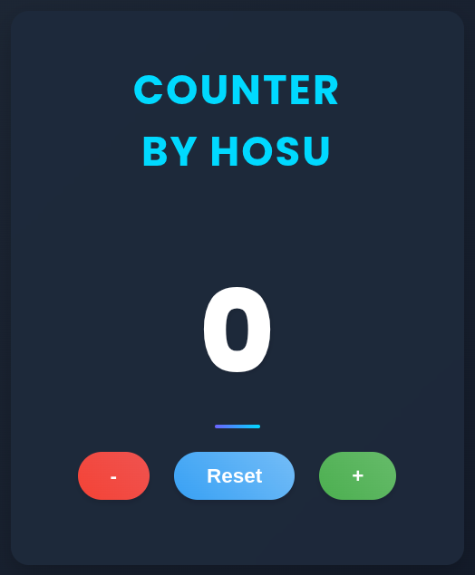

# TypeScript Number Counter by Hosu

<p align="center">
  
</p>

A modern, responsive counter application built with TypeScript featuring increment, decrement, and reset functionality.

## Features

- ✨ Clean, modern UI with responsive design
- 🔢 Increment and decrement with configurable step values
- 🔄 Reset functionality to return to zero
- 💾 Persistent counter value using localStorage
- 📱 Mobile-friendly design
- 🌙 Dark mode support
- ♿ Accessibility features (keyboard navigation, ARIA attributes)
- 🎬 Smooth animations when counter values change

## Technologies Used

- TypeScript
- HTML5
- CSS3
- LocalStorage API

## Project Structure

```
number_counter_by_hosu/
├── src/
│   ├── app.ts         # Application entry point
│   ├── Counter.ts     # Main Counter class implementation
│   ├── interfaces.ts  # TypeScript interfaces
│   └── styles.css     # Styling
└── index.html         # Main HTML page
```

## Getting Started

### Prerequisites

- Node.js (v14 or later recommended)
- npm or yarn

### Installation

1. Clone the repository:
   ```bash
   git clone https://github.com/hosu-kim/number_counter_by_hosu.git
   cd typescript_number_counter_by_hosu
   ```

2. Install dependencies:
   ```bash
   npm install
   ```

### Running the Application

1. Build the TypeScript files:
   ```bash
   npm run build
   ```

2. Start the development server:
   ```bash
   npm start
   ```

3. Open your browser and navigate to `http://localhost:3000`

### Development

To watch for changes and automatically compile:
```bash
npm run watch
```

## Usage

- Click the "+" button to increment the counter
- Click the "-" button to decrement the counter
- Click "Reset" to set the counter back to 0
- The counter value persists across browser sessions

## Configuration

The counter can be configured with several options:

```typescript
const counterOptions = {
  initialValue: 0,    // Starting value
  minValue: -1000,    // Minimum allowed value
  maxValue: 1000,     // Maximum allowed value
  step: 1             // Increment/decrement step size
};
```

## Code Example

```typescript
import { Counter } from './Counter';
import { CounterOptions } from './interfaces';

// Create counter instance with options
const counterOptions: CounterOptions = {
  initialValue: 0,
  minValue: -100,
  maxValue: 100,
  step: 1
};

const counter = new Counter(
  counterElement,
  incrementButton,
  decrementButton,
  resetButton,
  counterOptions
);

// Add event listener for counter changes
counter.addChangeListener((newCount) => {
  console.log(`Counter value changed to: ${newCount}`);
});
```

## License

MIT

## Author

hosu-kim
